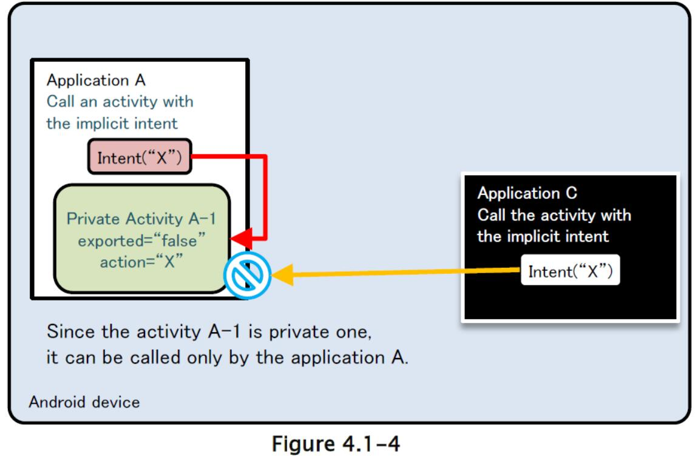
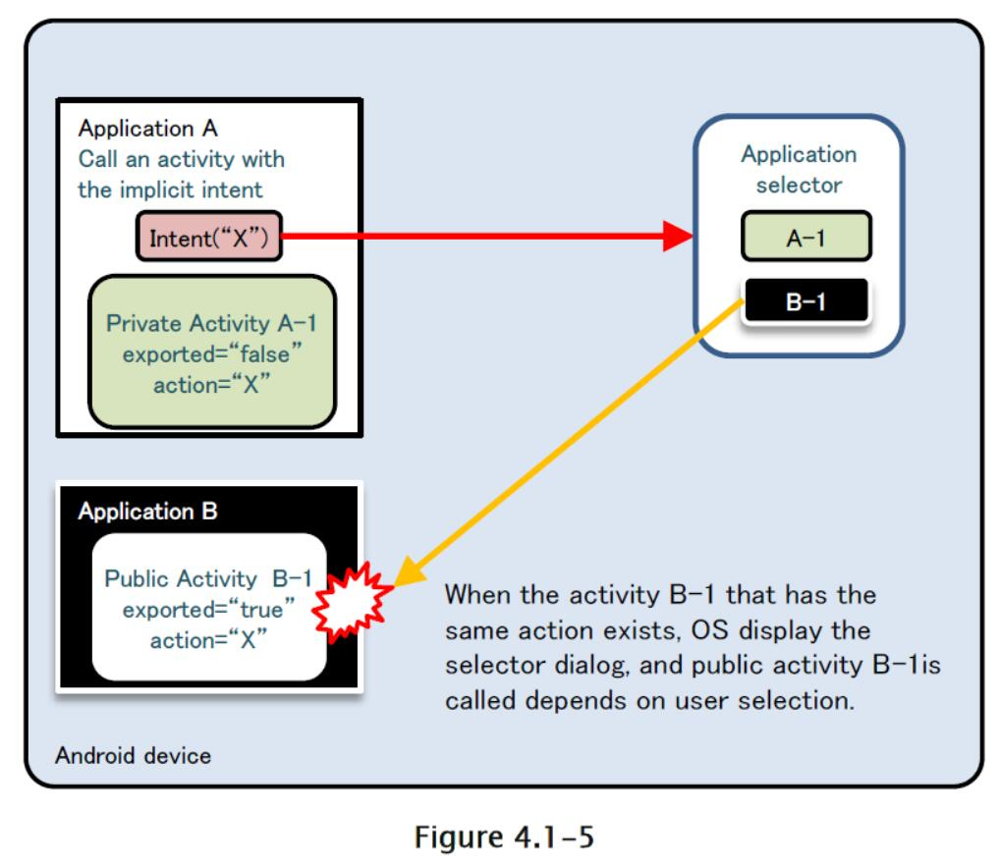

### 4.1.3 高级话题

#### 4.1.3.1 组合导出属性和意图过滤器（对于活动）

我们已经解释了如何实现本指南中的四类活动：私有活动，公共活动，伙伴活动和内部活动。 下表中定义了每种类型的导出属性的允许的设置，和`intent-filter`元素的各种组合，它们在`AndroidManifest.xml`文件中定义。 请使用您尝试创建的活动，验证导出属性和`intent-filter`元素的兼容性。

| | 导出属性的值 | |
| --- | --- | --- |
| | True | False | 未指定 | 
| 意图过滤器已定义 | 公开 | （不使用） |（不使用） |
| 意图过滤器未定义 | 公开、伙伴、内部 | `AndroidManifest.xml` |（不使用） |

表 4.1-2

当未指定`Activity`的导出属性时，`Activity`是否为公开的，取决于`Activity`的意图过滤器的存在与否 [4]。 但是，在本手册中，禁止将导出属性设置为未指定。通常，如前所述，最好避免依赖任何给定 API 的默认行为的实现；此外，如果存在明确的方法（例如导出属性）来启用重要的安全相关设置，那么使用这些方法总是一个好主意。

> 如果定义了任何意图过滤器，则该活动是公开的；否则它是私有的。更多信息请参阅 <https://developer.android.com/guide/topics/manifest/activity-element.html#exported>。

不应该使用未定义的意图过滤器和导出属性`false`的原因，是 Android 的行为存在漏洞，并且由于意图过滤器的工作原理，其他应用的活动可能会意外调用它。下面的两个图展示了这个解释。图 4.1-4 是一个正常行为的例子，其中私有活动（应用程序 A）只能由同一个应用程序的隐式`Intent`调用。 意图过滤器（`action ="X"`）被定义为仅在应用程序 A 内部工作，所以这是预期的行为。

下面的图 4.1-5 展示了一个场景，其中在应用程序 B 和应用程序 A 中定义了相同的意图过滤器（`action ="X"`）。应用程序 A 试图通过发送隐式意图，来调用同一应用程序中的私有活动 ，但是这次显示了对话框，询问用户选择哪个应用程序，以及应用程序 B 中的公共活动 B-1 ，由于用户的选择而错误调用。 由于这个漏洞，可能会将敏感信息发送到其他应用程序，或者应用程序可能会收到意外的返回值。

如上所示，使用意图过滤器，将隐式意图发送到私有应用，可能会导致意外行为，因此最好避免此设置。 另外，我们已经验证了这种行为不依赖于应用程序 A 和应用程序 B 的安装顺序。
