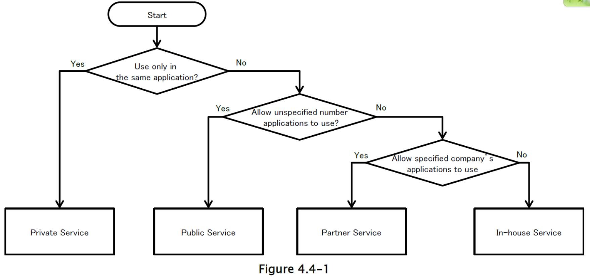

### 4.4.1 示例代码

使用服务的风险和对策取决于服务的使用方式。 您可以通过下面展示的图表找出您应该创建的服务类型。 由于安全编码的最佳实践，根据服务的创建方式而有所不同，因此我们也将解释服务的实现。

表 4.4-1 服务类型的定义

| 类型 | 定义 |
| --- | --- |
| 私有 | 不能由其他应用加载，所以是最安全的服务 |
| 公共 | 应该由很多未指定的应用使用的服务 |
| 伙伴 | 只能由可信的伙伴公司开发的应用使用的服务 |
| 内部 | 只能由其他内部应用使用的服务 |

有几种服务实现方法，您将选择匹配您想要创建的服务类型的方法。 表中列的条目展示了实现方法，并将它们分为 5 种类型。 “OK”表示可能的组合，其他表示不可能/困难的组合。 

服务的详细实现方法，请参阅“4.4.3.2 如何实现服务”和每个服务类型的示例代码（在表中带有`*`标记）。

表 4.4-2

| 类别 | 私有服务 | 公共服务 | 伙伴服务 | 内部服务 |
| --- | --- | --- | --- | --- |
| `startService`类型 | OK\* | OK | - | OK |
| `IntentService`类型 | OK | OK\* | - | OK |
| 本地绑定类型 | OK | - | - | - |
| `Messenger`绑定类型 | OK | OK | - | OK\* |
| AIDL 绑定类型 | OK | OK | OK\* | OK |

每种服务安全类型的示例代码展示在下面，通过表 4.4-2 中的使用`*`标记。
