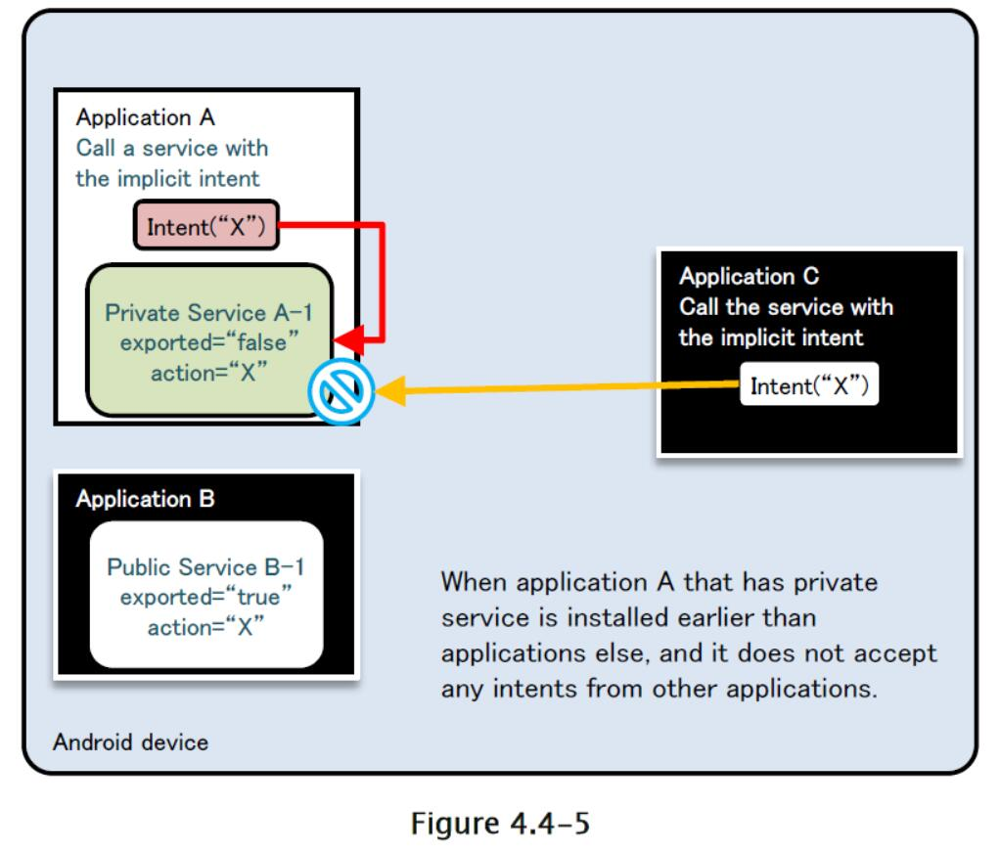
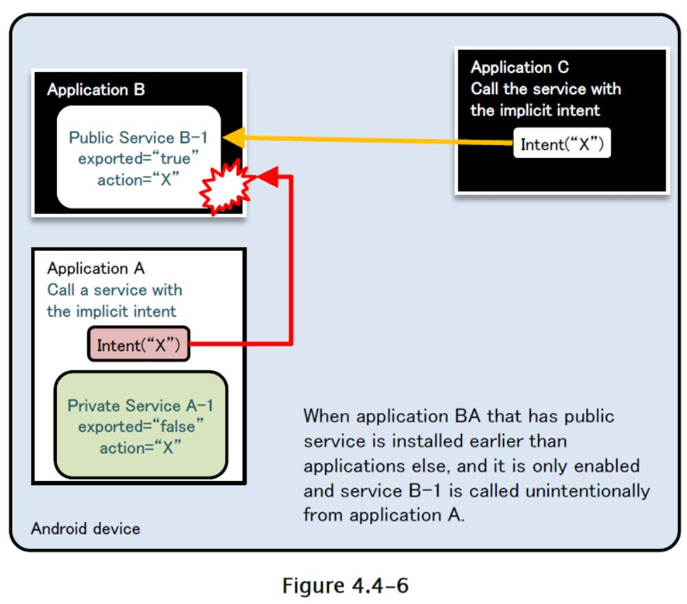

### 4.4.3 高级话题

#### 4.4.3.1 导出属性和意图过滤器设置的组合（在服务情况下）

我们已经本指南中解释了如何在实现四种服务类型：私有服务，公共服务，伙伴服务和内部服务。 下表中定义了每种导出属性类型的许可设置，以及`intent-filter`元素的各种组合，它们`AndroidManifest.xml`文件中定义。 请验证导出属性和`intent-filter`元素与你尝试创建的服务的兼容性。

表 4.4-3 

| | 导出属性的值 | | |
| --- | --- | --- | --- |
| | True | False | 未指定 |
| 意图过滤器已定义 | 公共 | （不使用） | （不使用） | 
| 意图过滤器未定义 | 公共，伙伴，内部 | 私有 | （不使用） |

如果服务中的导出属性是未指定的，服务是否公开由是否定义了意图过滤器决定 [9]；但是，在本指南中，禁止将服务的导出属性设置为未指定。 通常，如前所述，最好避免依赖任何给定 API 的默认行为的实现; 此外，如果存在显式方法来配置重要的安全相关设置，例如导出属性，那么使用这些方法总是一个好主意。

> [9] 如果定义了任何意图过滤器，服务是公开的，否则是私有的。更多信息请见 <https://developer.android.com/guide/topics/manifest/service-element.html#exported>。

不应该使用未定义的意图过滤器和导出属性`false`的原因是，Android 的行为存在漏洞，并且由于意图过滤器的工作原理，可能会意外调用其他应用的服务。

具体而言，Android 的行为如下，因此在设计应用时需要仔细考虑。

+   当多个服务定义了相同的意图过滤器内容时，更早安装的应用中的服务是优先的。
+   如果使用显式意图，则优先的服务将被自动选择并由 OS 调用。

以下三张图描述了一个系统，由于 Android 行为而发生意外调用的。 图 4.4-4 是一个正常行为的例子，私有服务（应用 A）只能由同一个应用通过隐式意图调用。 因为只有应用 A 定义了意图过滤器（图中的`action ="X"`），所以它的行为正常。 这是正常的行为。

图 4.4-5 和图 4.4-6 展示了一个情景，其中应用 B 和应用 A 中定义了相同的意图过滤器（`action ="X"`）。

图 4.4-5 展示了应用按`A -> B`的顺序安装。在这种情况下，当应用 C 发送隐式意图时，私有服务（A-1）调用失败。 另一方面，由于应用 A 可以通过隐式意图，按照预期成功调用应用内的私有服务，因此在安全性（恶意软件的对策）方面不会有任何问题。

图 4.4-6 展示了一个场景，应用以`B->A`的顺序安装。 就安全性而言，这里存在一个问题，应用 A 尝试通过发送隐式意图来，调用应用中的私有服务，但实际上调用了之前安装的应用 B 中的公共活动（B-1）。 由于这个漏洞，敏感信息可能会从应用 A 发送到应用 B。 如果应用 B 是恶意软件，它会导致敏感信息的泄漏。

如上所示，使用意图过滤器向私有服务发送隐式意图，可能会导致意外行为，因此最好避免此设置。

#### 4.4.3.2 如何实现服务

由于实现服务的方法是多种多样的，应该按安全类型进行选择，它由示例代码分类，本文对各个特性进行了简要说明。 它大致分为使用`startService`和使用`bindService`的情况。 还可以创建在`startService`和`bindService`中都可以使用的服务。 应该调查以下项目来确定服务的实现方法。

+   是否将服务公开给其他应用（服务的公开）
+   是否在运行中交换数据（相互发送/接收数据）
+   是否控制服务（启动或完成）
+   是否作为另一个进程执行（进程间通信）
+   是否并行执行多个进程（并行进程）

表 4.4-3 显示了每个条目的实现方法类别和可行性。 “NG”代表不可能的情况，或者需要另一个框架的情况，它与所提供的函数不同。

