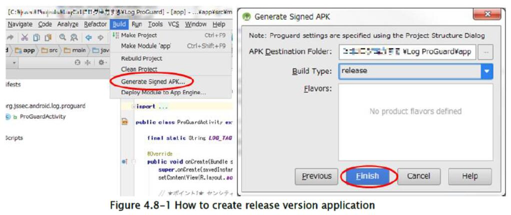
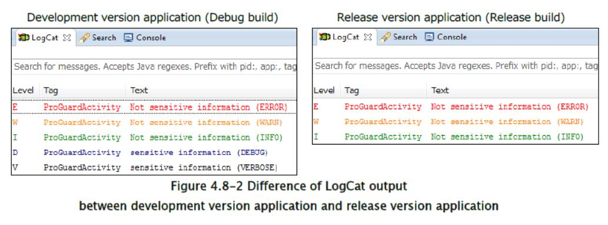

## 4.8 输出到 LogCat

在 Android 中有一种名为 LogCat 的日志机制，不仅系统日志信息，还有应用日志信息也会输出到 LogCat。 LogCat 中的日志信息可以从同一设备中的其他应用中读出 [17]，因此向L ogcat 输出敏感信息的应用，被认为具有信息泄露的漏洞。 敏感信息不应输出到 LogCat。 

> [17] 输出到 LogCat 的日志信息，可以由声明`READ_LOGS`权限的应用读取。 但是，在 Android 4.1 及更高版本中，无法读取其他应用输出的日志信息。 但智能手机用户可以通过 ADB ，阅读输出到 logcat 的每个日志信息。

从安全角度来看，在发行版应用中，最好不要输出任何日志。 但是，即使在发行版应用的情况下，在某些情况下也会出于某种原因输出日志。 在本章中，我们将介绍一些方法，以安全的方式将消息输出到 LogCat，即使在发行版应用中也是如此。 除此解释外，请参考“4.8.3.1 发行版应用中日志输出的两种思路”。

### 4.8.1 示例代码

接下来是在发行版应用中，通过 ProGuard 控制输出到 LogCat 的日志的方法。 ProGuard 是自动删除不需要的代码（如未使用的方法等）的优化工具之一。

`android.util.Log`类有五种类型的日志输出方法：`Log.e()`, `Log.w()`, `Log.i()`, `Log.d()`, `Log.v()`。对于日志信息，有意输出的日志信息（以下称为“操作日志信息”）应该区分于不适合发行版应用的信息（以下称为开发日志信息），例如调试日志。建议使用`Log.e()/w()/i()`输出操作日志信息，并使用`Log.d()/v()`输出开发日志。正确使用五种日志输出方法的详细信息，请参阅“4.8.3.2 日志级别和日志输出方法的选择标准”，另外请参考“4.8.3.3 调试日志和`VERBOSE`日志并不总是自动删除”。

这是一个以安全方式使用 LogCat 的例子。此示例包括用于输出调试日志的`Log.d()`和`Log.v()`。如果应用用于发布，这两种方法将被自动删除。在此示例代码中，ProGuard 用于自动删除调用`Log.d()/v()`的代码块。

要点：

1) 敏感信息不能由`Log.e()/w()/i()`，`System.out / err`输出。

2) 敏感信息应由`Log.d()/v()`在需要时输出。

3) 不应使用`Log.d()/v()`的返回值（以替换或比较为目的）。

4) 当你构建应用来发布时，你应该在代码中引入机制，自动删除不合适的日志记录方法（如`Log.d()`或`Log.v()`）。

5) 必须使用发行版构建配置来创建用于（发布）发行的 APK 文件。

ProGuardActivity.java

```java
package org.jssec.android.log.proguard;

import android.app.Activity;
import android.os.Bundle;
import android.util.Log;

public class ProGuardActivity extends Activity {

    final static String LOG_TAG = "ProGuardActivity";
    
    @Override
    public void onCreate(Bundle savedInstanceState) {
        super.onCreate(savedInstanceState);
        setContentView(R.layout.activity_proguard);
        // *** POINT 1 *** Sensitive information must not be output by Log.e()/w()/i(), System.out/err.
        Log.e(LOG_TAG, "Not sensitive information (ERROR)");
        Log.w(LOG_TAG, "Not sensitive information (WARN)");
        Log.i(LOG_TAG, "Not sensitive information (INFO)");
        // *** POINT 2 *** Sensitive information should be output by Log.d()/v() in case of need.
        // *** POINT 3 *** The return value of Log.d()/v()should not be used (with the purpose of substitution or comparison).
        Log.d(LOG_TAG, "sensitive information (DEBUG)");
        Log.v(LOG_TAG, "sensitive information (VERBOSE)");
    }
}
```

proguard-project.txt

```
# prevent from changing class name and method name etc.
-dontobfuscate
# *** POINT 4 *** In release build, the build configurations in which Log.d()/v() are deleted automatica
lly should be constructed.
-assumenosideeffects class android.util.Log {
    public static int d(...);
    public static int v(...);
}
```

要点 5：必须使用发行版构建配置来创建用于（发布）发行的 APK 文件。



开发版应用（调试版本）和发行版应用（发布版本）之间的LogCat 输出差异如下图 4.8-2 所示。



### 4.8.2 规则书

输出消息记录时，遵循以下规则：

#### 4.8.2.1 操作日志信息中不能包含敏感信息（必需）

输出到 LogCat 的日志可以从其他应用中读取，因此敏感信息（如用户的登录信息）不应该由发行版应用输出。 在开发过程中，不必编写输出敏感信息的代码，或者在发布之前需要删除所有这些代码。 

为了遵循这个规则，首先，不要在操作日志信息中包含敏感信息。 此外，建议构建系统，在构建发行版时，删除输出敏感信息的代码。 请参阅“4.8.2.2 构建生成系统，在构建发行版时，自动删除输出开发日志信息的代码（推荐）”。

#### 4.8.2.2 构建生成系统，在构建发行版时，自动删除输出开发日志信息的代码（推荐）

开发应用时，有时最好将敏感信息输出到日志中，来检查过程内容和调试，例如复杂逻辑过程中的临时操作结果，程序内部状态信息，通信协议的数据结构。在开发过程中，将敏感信息作为调试日志输出并不重要，在这种情况下，相应的日志输出代码应该在发布之前删除，如“4.8.2.1 操作日志信息中不能包含敏感信息（必需）”所述。

为了在构建发行版时，确实删除了输出开发日志信息的代码，应该构建系统，使用某些工具自动执行代码删除。 “4.8.1 示例代码”中介绍的 ProGuard 可以用于此方法。如下所述，用 ProGuard 删除代码有一些值得注意的地方。这里应该将系统用于一些应用，它通过`Log.d()/ v()`输出开发日志信息，根据“4.8.3.2 日志级别和日志输出方法的选择标准”。 

ProGuard 会自动删除不需要的代码，如未使用的方法。通过指定`Log.d()/ v()`作为`-assumenosideeffects`选项的参数，`Log.d()，`Log.v()`的调用被视为不必要的代码，并且这些代码将被删除。

```
-assumenosideeffects class android.util.Log {
    public static int d(...);
    public static int v(...);
}
```

如果使用这个自动删除系统，请注意`Log.d()`，`Log.v()`代码在使用其返回值时不会被删除，因此不应该使用`Log.d()`，`Log.v()`的返回值。 例如，下一个代码中的`Log.v()`不会被删除。

```java
int i = android.util.Log.v("tag", "message");
System.out.println(String.format("Log.v() returned %d. ", i)); //Use the returned value of Log.v() for examination
```

如果你想重复使用源代码，则应保持项目环境的一致性，包括 ProGuard 设置。 例如，预设`Log.d()`和`Log.v()`的源代码将被上面的 ProGuard 设置自动删除。 如果在未设置 ProGuard 的其他项目中使用此源代码，则不会删除`Log.d()`和`Log.v()`，因此可能会泄露敏感信息。 重用源代码时，应确保包括 ProGuard 设置在内的项目环境的一致性。

#### 4.8.2.3 输出`Throwable`对象时，使用`Log.d()/v()`（推荐）

如“4.8.1 示例代码”和“4.8.3.2 日志级别和日志输出方法的选择标准”中所述，输出敏感信息不应通过`Log.e()/w()/i()`输出来记录。 另一方面，为了使开发者输出程序异常的细节来记录，当异常发生时，在某些情况下，堆栈踪迹通过`Log.e(..., Throwable tr)/w(..., Throwable tr)/i(..., Throwable
tr)`输出到 LogCat。 但是，敏感信息有时可能包含在堆栈踪迹中，因为它显示程序的详细内部结构。 例如，当`SQLiteException`按原样输出时，会输出 SQL 语句的类型，因此可能会提供 SQL 注入攻击的线索。 因此，建议在输出`Throwable`对象时，仅使用`Log.d()/v()`方法。

#### 4.8.2.4 仅仅将`android.util.Log`类的方法用于日志输出（推荐）

在开发过程中，你可以通过`System.out / err`输出日志，来验证应用的行为是否按预期工作。 当然，日志可以通过`System.out / err`的`print()/ println()`方法输出到 LogCat，但强烈建议仅使用`android.util.Log`类的方法，原因如下。 

在输出日志时，一般根据信息的紧急程度，正确使用最合适的输出方法，并控制输出。 例如，使用严重错误，注意，简单应用的信息通知等类别。 然而，在这种情况下，在发布时需要输出的信息（操作日志信息），和可以包括敏感信息（开发日志信息）的信息，通过相同的方法输出。 所以，当删除输出敏感信息的代码时，可能会存在一些删除操作被忽略掉的危险。

除此之外，当使用`android.util.Log`和`System.out / err`进行日志输出时，与仅使用`android.util.Log`相比，需要考虑的因素会增加，因此可能会出现一些错误，比如 一些删除被忽略掉了。 

为了减少上述错误发生的风险，建议仅使用`android.util.Log`类的方法。

### 4.8.3 高级话题

#### 4.8.3.1 发布版应用中日志输出的两种思路

发布版应用中有两种思考日志输出的方式。一个是任何日志都不应该输出，另一个是用于以后分析的必要信息应该作为日志输出。从安全角度来看，最好是，任何日志都不应该在发行版应用中输出，但有时候，即使在发行版本应用中，出于各种原因也会输出日志。每种思考方式按照以下描述。

前者是“任何日志都不应该输出”，这是因为，在发行版应用中输出日志没有那么重要，并且存在泄露敏感信息的风险。这是因为开发人员没有办法在 Android 应用运行环境中收集发行版应用的日志信息，这与许多 Web 应用的运行环境不同。基于这种思想，日志代码仅用于开发阶段，并且在构建发行版应用时删除所有日志代码。

后者是“必要的信息应作为日志输出，以供日后分析”，作为客户支持中，分析应用错误的最终选项，以防你的客户支持有任何疑问。 基于这个想法，如上所述，有必要准备系统来防止人为错误并将其引入到项目中，因为如果你没有系统，则必须记住避免在发行版应用中记录敏感信息。

更多日志方法的信息，请参考下面的链接：

适用于贡献者/日志的代码风格指南

http://source.android.com/source/code-style.html#log-sparingly

#### 4.8.3.2 日志级别和日志输出方法的选择标准

在 Android 中的`android.util.Log`类中定义了五个日志级别（`ERROR`，`WARN`，`INFO`，`DEBUG`，`VERBOSE`）。 使用`android.util.Log`类输出日志消息时，应该选择最合适的方法，如表 4.8-1 所示，它展示了日志级别和方法的选择标准。

表 4.8-1  日志级别和方法的选择标准

| 日志级别 | 方法 | 要输出的日志信息 | 
| --- | --- | --- |
| `ERROR` | `Log.e()` | 应用处于错误状态时，输出的日志信息 |
| `WARN` | `Log.w()` | 应用面临非预期严重情况时，输出的日志信息 |
| `INFO` | `Log.i()` | 与上面不同，用于提示应用状态中任何值得注意的更改或者结果 |
| `DEBUG` | `Log.d()` | 应用的内部状态信息，开发应用时，需要临时输出，用于分析特定 bug 的成因 |
| `VERBOSE` | `Log.v()` | 不属于上面任何一个的日志信息。应用开发者以多种目的输出。例如，输出服务器通信信息来转储。 |

发行版应用的注意事项：

`e/w/i`：

日志信息可能由用户参考，因此可以在开发版应用和发行版应用中输出。 因此，敏感信息不应该在这些级别输出。

`d/v`：

日志信息仅适用于应用开发人员。 因此，这种类型的信息不应该在发行版的情况下输出。

更多日志方法的信息，请参考下面的链接：

适用于贡献者/日志的代码风格指南

http://source.android.com/source/code-style.html#log-sparingly

#### 4.8.3.3 `DEBUG`和`VERBOSE`日志并不总是自动删除

以下引用自`android.util.Log`类 [18] 的开发人员参考。 

> [18] ttp://developer.android.com/reference/android/util/Log.html

按照啰嗦程度的顺序排列，从最少到最多是`ERROR`，`WARN`，`INFO`，`DEBUG`，`VERBOSE`。 除了在开发期间，绝不应该将`VERBOSE`编译进应用。 `DEBUG`日志被编译但在运行时剥离。 始终保留`ERROR`，`WARN`，`INFO`日志。 

在阅读了上述文章之后，一些开发人员可能会误解`Log`类的行为，如下所示。

+   构建发行版时不编译`Log.v()`调用，`VERBOSE`日志从不输出。
+   编译`Log.v()`调用，但执行时绝不输出`DEBUG`日志。

但是，日志记录方法从来不会表现成这样，并且无论使用调试模式还是发布模式编译，都会输出所有消息。 如果仔细阅读文档，你将能够认识到，文档的要点与日志方法的行为无关，而是日志的基本策略。

