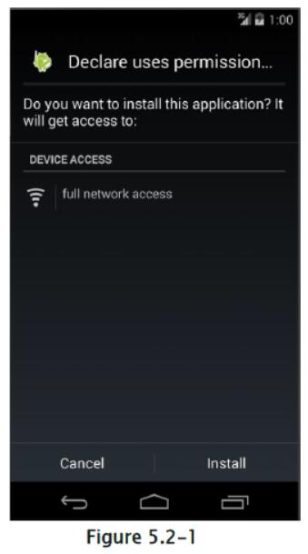

### 5.2.1 示例代码

#### 5.2.1.1 如何使用 Android OS 的系统权限

Android 操作系统有一个称为“权限”的安全机制，可以保护其用户的资产（如联系人和 GPS 功能）免受恶意软件的侵害。 当应用请求访问受 Android OS 保护的信息或功能时，应用需要显式声明权限才能访问它们。 安装应用，它申请需要用户同意的权限时，会出现以下确认界面 [23]。

> [23] 在 Android 6.0（API Level 23）及更高版本中，安装应用时不会发生用户的权限授予或拒绝，而是在应用请求权限时在运行时发生。 更多详细信息，请参见“5.2.1.4 在 Android 6.0 及更高版本中使用危险权限的方法”和“5.2.3.6 Android 6.0 和更高版本中的权限模型规范的修改”部分。



从该确认界面中，用户能够知道，应用试图访问哪些类型的特征或信息。 如果应用试图访问明显不需要的功能或信息，那么该应用很可能是恶意软件。 因此，为了使你的应用不被怀疑是恶意软件，因此需要尽量减少使用权限声明。

要点：

1.  使用`uses-permission`声明应用中使用的权限。
2.  不要用`uses-permission`声明任何不必要的权限。

AndroidManifest.xml

```xml
<?xml version="1.0" encoding="utf-8"?>
<manifest xmlns:android="http://schemas.android.com/apk/res/android"
    package="org.jssec.android.permission.usespermission" >
    <!-- *** POINT 1 *** Declare a permission used in an application with uses-permission -->
    <!-- Permission to access Internet -->
    <uses-permission android:name="android.permission.INTERNET"/>
    <!-- *** POINT 2 *** Do not declare any unnecessary permissions with uses-permission -->
    <!-- If declaring to use Permission that is unnecessary for application behaviors, it gives users a
    sense of distrust. -->
    <application
        android:allowBackup="false"
        android:icon="@drawable/ic_launcher"
        android:label="@string/app_name" >
        <activity
            android:name=".MainActivity"
            android:label="@string/app_name"
            android:exported="true" >
            <intent-filter>
                <action android:name="android.intent.action.MAIN" />
                <category android:name="android.intent.category.LAUNCHER" />
            </intent-filter>
        </activity>
    </application>
</manifest>
```

#### 5.2.1.2 如何使用内部定义的权限在内部应用之间通信

除了由 Android OS 定义的系统权限之外，应用还可以定义自己的权限。 如果使用内部定义的权限（内部定义的签名权限更准确），则可以构建只允许内部应用之间进行通信的机制。 通过提供基于多个内部应用之间的，应用间通信的复合功能，应用变得更具吸引力，你的企业可以通过将其作为系列销售获得更多利润。 这是使用内部定义的签名权限的情况。

示例应用“内部定义的签名权限（UserApp）”使用`Context.startActivity()`方法启动示例应用“内部定义的签名权限（ProtectedApp）”。 两个应用都需要使用相同的开发人员密钥进行签名。如果用于签名的密钥不同，则`UserApp`不会向`ProtectedApp`发送意图，并且`ProtectedApp`不处理从`UserApp`收到的意图。 此外，它还可以防止恶意软件使用安装顺序相关的事项，绕过你自己的签名权限，如高级话题部分中所述。


要点：提供组件的应用

1) 使用`protectionLevel="signature"`定义权限。

2) 对于组件，使用其权限属性强制规定权限。

3) 如果组件是活动，则必须没有定义意图过滤器。

4) 在运行时，验证签名权限是否由程序代码本身定义。

5) 导出 APK 时，请使用与使用该组件的应用相同的开发人员密钥对 APK 进行签名。

AndroidManifest.xml

```xml
<?xml version="1.0" encoding="utf-8"?>
<manifest xmlns:android="http://schemas.android.com/apk/res/android"
    package="org.jssec.android.permission.protectedapp" >
    <!-- *** POINT 1 *** Define a permission with protectionLevel="signature" -->
    <permission
        android:name="org.jssec.android.permission.protectedapp.MY_PERMISSION"
        android:protectionLevel="signature" />
    <application
        android:allowBackup="false"
        android:icon="@drawable/ic_launcher"
        android:label="@string/app_name" >
        <!-- *** POINT 2 *** For a component, enforce the permission with its permission attribute -->
        <activity
            android:name=".ProtectedActivity"
            android:exported="true"
            android:label="@string/app_name"
            android:permission="org.jssec.android.permission.protectedapp.MY_PERMISSION" >
            <!-- *** POINT 3 *** If the component is an activity, you must define no intent-filter -->
        </activity>
    </application>
</manifest>
```

ProtectedActivity.java

```java
package org.jssec.android.permission.protectedapp;

import org.jssec.android.shared.SigPerm;
import org.jssec.android.shared.Utils;
import android.app.Activity;
import android.content.Context;
import android.os.Bundle;
import android.widget.TextView;

public class ProtectedActivity extends Activity {

    // In-house Signature Permission
    private static final String MY_PERMISSION = "org.jssec.android.permission.protectedapp.MY_PERMISSION";
    // Hash value of in-house certificate
    private static String sMyCertHash = null;
    
    private static String myCertHash(Context context) {
        if (sMyCertHash == null) {
            if (Utils.isDebuggable(context)) {
                // Certificate hash value of "androiddebugkey" of debug.keystore
                sMyCertHash = "0EFB7236 328348A9 89718BAD DF57F544 D5CCB4AE B9DB34BC 1E29DD26 F77C8255";
            } else {
                // Certificate hash value of "my company key" of keystore
                sMyCertHash = "D397D343 A5CBC10F 4EDDEB7C A10062DE 5690984F 1FB9E88B D7B3A7C2 42E142CA";
            }
        }
        return sMyCertHash;
    }
    
    private TextView mMessageView;
    
    @Override
    public void onCreate(Bundle savedInstanceState) {
        super.onCreate(savedInstanceState);
        setContentView(R.layout.main);
        mMessageView = (TextView) findViewById(R.id.messageView);
        // *** POINT 4 *** At run time, verify if the signature permission is defined by itself on the program code
        if (!SigPerm.test(this, MY_PERMISSION, myCertHash(this))) {
            mMessageView.setText("In-house defined signature permission is not defined by in-house application.");
            return;
        }
        // *** POINT 4 *** Continue processing only when the certificate matches
        mMessageView.setText("In-house-defined signature permission is defined by in-house application,
        was confirmed.");
    }
}
```

SigPerm.java

```java
package org.jssec.android.shared;

import android.content.Context;
import android.content.pm.PackageManager;
import android.content.pm.PackageManager.NameNotFoundException;
import android.content.pm.PermissionInfo;

public class SigPerm {

    public static boolean test(Context ctx, String sigPermName, String correctHash) {
        if (correctHash == null) return false;
        correctHash = correctHash.replaceAll(" ", "");
        return correctHash.equals(hash(ctx, sigPermName));
    }
    
    public static String hash(Context ctx, String sigPermName) {
        if (sigPermName == null) return null;
        try {
            // Get the package name of the application which declares a permission named sigPermName.
            PackageManager pm = ctx.getPackageManager();
            PermissionInfo pi;
            pi = pm.getPermissionInfo(sigPermName, PackageManager.GET_META_DATA);
            String pkgname = pi.packageName;
            // Fail if the permission named sigPermName is not a Signature Permission
            if (pi.protectionLevel != PermissionInfo.PROTECTION_SIGNATURE) return null;
            // Return the certificate hash value of the application which declares a permission named sigPermName.
            return PkgCert.hash(ctx, pkgname);
        } catch (NameNotFoundException e) {
            return null;
        }
    }
}
```

PkgCert.java

```java
package org.jssec.android.shared;

import java.security.MessageDigest;
import java.security.NoSuchAlgorithmException;
import android.content.Context;
import android.content.pm.PackageInfo;
import android.content.pm.PackageManager;
import android.content.pm.PackageManager.NameNotFoundException;
import android.content.pm.Signature;

public class PkgCert {

    public static boolean test(Context ctx, String pkgname, String correctHash) {
        if (correctHash == null) return false;
        correctHash = correctHash.replaceAll(" ", "");
        return correctHash.equals(hash(ctx, pkgname));
    }
    
    public static String hash(Context ctx, String pkgname) {
        if (pkgname == null) return null;
        try {
            PackageManager pm = ctx.getPackageManager();
            PackageInfo pkginfo = pm.getPackageInfo(pkgname, PackageManager.GET_SIGNATURES);
            if (pkginfo.signatures.length != 1) return null; // Will not handle multiple signatures.
            Signature sig = pkginfo.signatures[0];
            byte[] cert = sig.toByteArray();
            byte[] sha256 = computeSha256(cert);
            return byte2hex(sha256);
        } catch (NameNotFoundException e) {
            return null;
        }
    }
    
    private static byte[] computeSha256(byte[] data) {
        try {
            return MessageDigest.getInstance("SHA-256").digest(data);
        } catch (NoSuchAlgorithmException e) {
            return null;
        }
    }
    
    private static String byte2hex(byte[] data) {
        if (data == null) return null;
        final StringBuilder hexadecimal = new StringBuilder();
        for (final byte b : data) {
            hexadecimal.append(String.format("%02X", b));
        }
        return hexadecimal.toString();
    }
}
```
