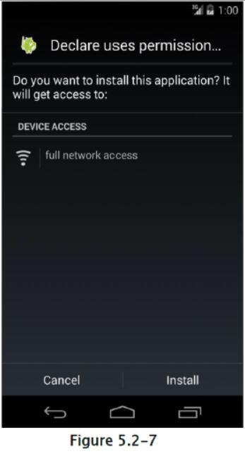

### 5.2.2 规则书

使用内部权限时，请确保遵循以下规则：

#### 5.2.2.1 Android 的系统危险权限只能用于保护用户资产（必需）

由于不建议你使用自己的危险权限（请参阅“5.2.2.2 你自己的危险权限不得使用（必需）”），我们将在使用 Android 操作系统的系统危险权限的前提下进行。 

不像其他三种类型的权限，危险权限具有这个特性，需要用户同意授予应用权限，在声明了危险权限的设备上安装应用时，将显示以下屏幕：随后， 用户可以知道应用试图使用的权限级别（危险权限和正常权限），当用户点击“安装”时，应用将被授予权限，然后安装。

应用可以处理开发人员希望保护的用户资产。 我们必须意识到，危险的权限只能保护用户资产，因为用户只是授予权限的人。 另一方面，开发人员想要保护的资产不能用上述方法保护。 

例如，假设应用具有一个组件，只与内部应用通信，它不允许从其他公司的任何应用访问该组件，并且通过危险权限的保护来实现。 当用户根据判断，向另一家公司的应用授予权限时，需要保护的内部资产可能通过应用授权来利用。 为了在此类情况下保护内部资产，我们建议使用内部定义的签名权限。

#### 5.2.2.2 不能使用你自己的危险权限（必需）

即使使用内部定义的危险权限，在某些情况下，屏幕提示“请求允许来自用户的权限”也不会显示。 这意味着，有时根据用户判断来请求权限的特性（危险权限的特征）不起作用。 因此，指导手册规定“不得使用内部定义的危险权限”。 

为了解释它，我们假设有两种类型的应用。 第一种类型的应用定义了内部危险权限，并且它让受此权限保护的组件公开。 我们称之为`ProtectedApp`。 另一个是我们称为`AttackerApp`，它试图利用`ProtectedApp`的组件。 我们还假设`AttackerApp`不仅声明了使用它的权限，而且还定义了相同的权限。

在以下情况下，`AttackerApp`可以在未经用户同意的情况下，使用`ProtectedApp`的组件：

1.  当用户安装`AttackerApp`时，安装将在没有屏幕提示的情况下完成，它要求用户授予应用危险权限。
2.  同样，当用户安装`ProtectedApp`时，安装将会完成而没有任何特别的警告。
3.  当用户启动`AttackerApp`后，`AttackerApp`可以访问`ProtectedApp`的组件，而不会被用户检测到，这可能会导致损失。

这种情况的原因在下面解释。 当用户尝试首先安装`AttackerApp`时，在特定设备上，尚未使用`uses-permission`来定义声明的权限。 没有发现错误，Android 操作系统将继续安装。 由于只有在安装时用户才需要同意危险权限，因此已安装的应用将被视为已被授予权限。 因此，如果稍后安装的应用的组件受到名称相同的危险权限的保护，则在未经用户同意的情况下，事先安装的应用将能够利用该组件。

此外，由于在安装应用时，确保存在 Android OS 定义的系统危险权限，每次安装具有`uses-permission`的应用时，都会显示用户验证提示。 只有在自定义危险权限的情况下才会出现此问题。 在写这篇文章的时候，还没有开发出可行方法，在这种情况下保护组件的访问。 因此，你不得使用你自己的危险权限。

#### 5.2.2.3 你自己的签名权限必需仅在提供方定义（必需）

如“5.2.1.2 如何使用内部定义的签名权限，在内部应用之间进行通信”中所示，在进行内部应用之间的内部通信时，通过检查签名权限，可以确保安全性。 当使用这种机制时，保护级别为签名的权限的定义，必须写在具有组件的提供方应用的`AndroidManifest.xml`中，但用户方应用不能定义签名权限。 

此规则也适用于`signatureOrSystem`权限。原因如下。

我们假设，在提供方应用之前安装了多个用户方应用，并且每个用户方应用，不仅要求提供方应用定义的签名权限，而且还定义了相同的权限。 在这些情况下，所有用户方应用都可以在安装提供方应用之后，立即访问提供方应用。 随后，卸载先安装的用户方应用时，权限的定义也将被删除，然后该权限将变为未定义。 因此，其余的用户方应用将无法访问提供方应用。
