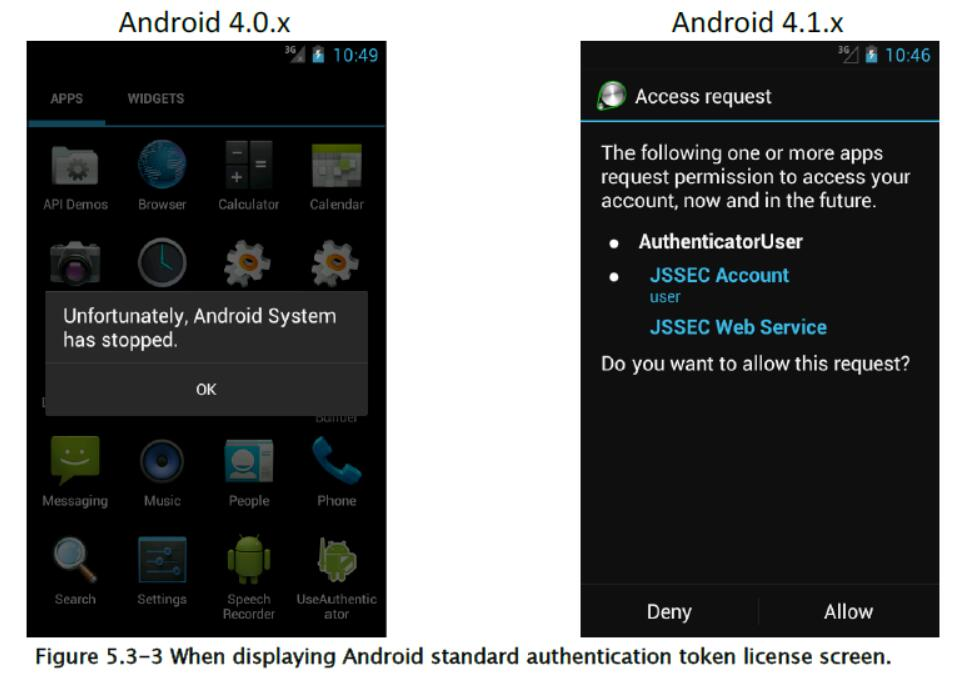

### 5.3.3 高级话题

#### 5.3.3.1 账户管理和权限的使用

要使用`AccountManager`类的每种方法，都需要在应用的`AndroidManifest.xml`中分别声明使用相应的权限。 表 5.3-1 显示了权限和方法的对应关系。

表 5.3-1 账户管理器的函数以及权限
 
|  | 账户管理器提供的函数 | |
| --- | --- | ---- |
| 权限 | 方法 | 解释 |
| `AUTHENTICATE_ACCOUNTS`（只有由认证器的相同密钥签名的软件包才可以使用。） | `getPassword()` | 获取密码 |
|  | `getUserData()` | 获取用户信息 |
|  | `addAccountExplicitly()` | 将账户添加到 DB |
|  | `peekAuthToken()` | 获取缓存令牌 |
|  | `setAuthToken()` | 注册认证令牌 |
|  | `setPassword()` | 修改密码 |
|  | `setUserData()` | 设置用户数据 |
|  | `renameAccount()` | 重命名账户 |
| `GET_ACCOUNTS` | `getAccounts()` | 获取所有账户的列表 |
| | `getAccountsByType()` | 获取指定类型的账户列表 |
| | `getAccountsByTypeAndFeatures()` | 获取带有特定特性的账户列表 |
| | `addOnAccountsUpdatedListener()` | 注册事件监听器 |
| | `hasFeatures()` | 它是否具有特定功能 |
| `MANAGE_ACCOUNTS` | `getAuthTokenByFeatures()` | 获取带有特定功能的账户的认证令牌 |
| | `addAccount()` | 请求用户添加账户 |
| | `removeAccount()` | 移除账户 |
| | `clearPassword()` | 初始化密码 |
| | `updateCredentials()` | 请求用户修改密码 |
| | `editProperties()` | 修改认证设置 |
| | `confirmCredentials()` | 请求用户再次输入密码 |
| `USE_CREDENTIALS` | `getAuthToken()` | 获取认证令牌 |
| | `blockingGetAuthToken()` | 获取认证令牌 |
| `MANAGE_ACCOUNTS`或`USE_CREDENTIALS` | `invalidateAuthToken()` | 删除缓存令牌 |

在使用需要`AUTHENTICATE_ACCOUNTS`权限的方法组的情况下，存在软件包的签名密钥以及权限相关的限制。 具体来说，提供认证器的包的签名密钥，和使用方法的应用的包的签名密钥应该是相同的。 因此，在分发使用方法组的应用时，除了认证器之外，必须使用`AUTHENTICATE_ACCOUNTS`权限，并且应使用认证器的相同密钥进行签名。

在 Android Studio 的开发阶段，由于固定的调试密钥库可能会被某些 Android Studio 项目共享，开发人员可能只考虑权限而不考虑签名，来实现和测试帐户管理器。 特别是，对于对每个应用使用不同签名密钥的开发人员来说，因为这种限制，在选择用于应用的密钥时要非常小心。 此外，由于`AccountManager`获得的数据包含敏感信息，因此需要小心处理，来减少泄漏或未授权使用的风险。

#### 5.3.3.2 在 Android 4.0.x 中，用户应用和认证器应用的签名密钥不同时发生的异常

认证令牌获取功能是由开发者密钥签发的用户应用所需的，它不同于认证器应用的签名密钥。通过显示 认证令牌许可证屏幕（`GrantCredentialsPermissionActivity`），`AccountManager`验证用户是否授予认证令牌的使用权。但是 Android 4.0.x 的 Android 框架中存在一个错误，只要`AccountManager`打开此屏幕，就会发生异常并且应用被强制关闭 。 （图5.3-3）。 错误的详细信息，请参阅 <https://code.google.com/p/android/issues/detail?id=23421>。 这个 bug 在 Android 4.1.x 及更高版本中无法找到。

