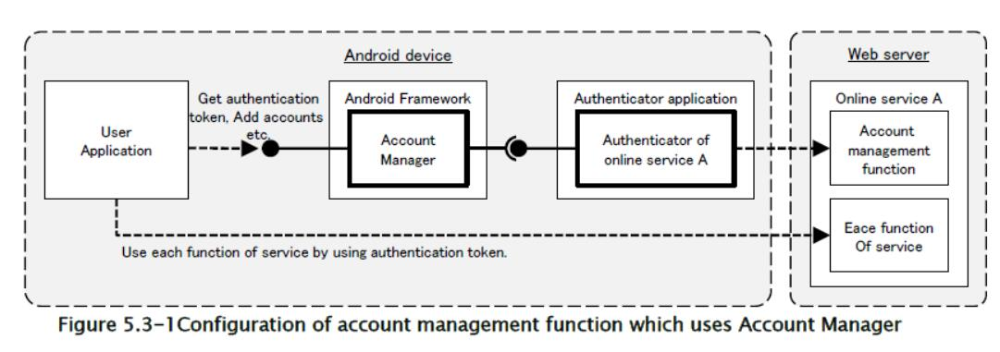

## 5.3 将内部账户添加到账户管理器

账户管理器是 Android OS 的系统，它集中管理帐户信息，是应用访问在线服务和认证令牌所必需的（帐户名称，密码）。 用户需要提前将账户信息注册到账户管理器，当应用尝试访问在线服务时，账户管理器在获得用户权限后，会自动提供应用认证令牌。 账户管理器的优势在于，应用不需要处理极其敏感的信息和密码。

使用账户管理器
的账户管理功能的结构如下图 5.3-1 所示。 “请求应用”是通过获取认证令牌，访问在线服务的应用，这是上述应用。 另一方面，“认证器应用”是账户管理器的功能扩展，并且向账户管理器提供称为认证器的对象，以便账户管理器可集中管理在线服务的账户信息和认证令牌。 请求应用和认证器应用不需要是单独的应用，因此这些应用可以实现为单个应用。

最初，用户应用（请求应用）和认证器应用的开发人员签名密钥可以是不同的密钥。 但是，Android 框架的错误仅在 Android 4.0.x 设备中存在 ，并且当用户应用和认证期应用的签名密钥不同时，用户应用中会发生异常，并且不能使用内部账户。 以下示例代码没有针对此缺陷实现任何替代方式。 详细信息请参阅“5.3.3.2 在 Android 4.0.x 中，用户应用和认证程序的签名密钥不同时发生的异常”。
