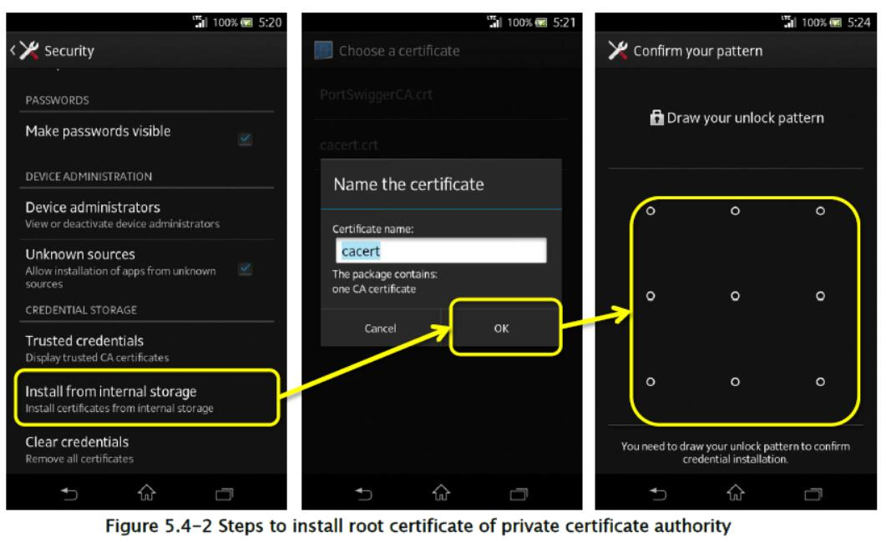

### 5.4.3 高级话题

#### 5.4.3.1 如何创建私有证书并配置服务器

在本节中，将介绍如何在 Linux（如 Ubuntu 和 CentOS）中创建私有证书和配置服务器。 私有证书是指私人签发的服务器证书，并由 Cybertrust 和 VeriSign 等可信第三方证书机构签发的服务器证书通知。


创建私有证书机构

首先，你需要创建一私有证书机构来颁发私有证书。 私有证书机构是指私有创建的证书机构以及私有证书。 你可以使用单个私有证书机构颁发多个私有证书。 存储私有认证机构的个人电脑应严格限制为只能由可信的人访问。 

为了创建私有证书机构，必须创建两个文件，例如以下 shell 脚本`newca.sh`和设置文件`openssl.cnf`，然后执行它们。 在 shell 脚本中，`CASTART`和`CAEND`代表证书机构的有效期，`CASUBJ`代表证书机构的名称。 所以这些值需要根据你创建的证书机构进行更改。 在执行 shell 脚本时，访问证书机构的密码总共需要 3 次，所以你需要每次都输入它。

newca.sh -- 创建证书机构的 Shell 脚本

```sh
#!/bin/bash

umask 0077

CONFIG=openssl.cnf
CATOP=./CA
CAKEY=cakey.pem
CAREQ=careq.pem
CACERT=cacert.pem
CAX509=cacert.crt
CASTART=130101000000Z # 2013/01/01 00:00:00 GMT
CAEND=230101000000Z # 2023/01/01 00:00:00 GMT
CASUBJ="/CN=JSSEC Private CA/O=JSSEC/ST=Tokyo/C=JP"

mkdir -p ${CATOP}
mkdir -p ${CATOP}/certs
mkdir -p ${CATOP}/crl
mkdir -p ${CATOP}/newcerts
mkdir -p ${CATOP}/private
touch ${CATOP}/index.txt

openssl req -new -newkey rsa:2048 -sha256 -subj "${CASUBJ}" ¥
    -keyout ${CATOP}/private/${CAKEY} -out ${CATOP}/${CAREQ}
openssl ca -selfsign -md sha256 -create_serial -batch ¥
    -keyfile ${CATOP}/private/${CAKEY} ¥
    -startdate ${CASTART} -enddate ${CAEND} -extensions v3_ca ¥
    -in ${CATOP}/${CAREQ} -out ${CATOP}/${CACERT} ¥
    -config ${CONFIG}
openssl x509 -in ${CATOP}/${CACERT} -outform DER -out ${CATOP}/${CAX509}
```

openssl.cnf -- 2 个 shell 脚本共同参照的 openssl 命令的设置文件

```
[ ca ]
default_ca = CA_default # The default ca section

[ CA_default ]
dir = ./CA # Where everything is kept
certs = $dir/certs # Where the issued certs are kept
crl_dir = $dir/crl # Where the issued crl are kept
database = $dir/index.txt # database index file.
                    #Proprietary-defined _subject = no # Set to 'no' to allow creation of
                    # several ctificates with same subject.
new_certs_dir = $dir/newcerts # default place for new certs.
certificate = $dir/cacert.pem # The CA certificate
serial = $dir/serial # The current serial number
crlnumber = $dir/crlnumber # the current crl number
                    # must be commented out to leave a V1 CRL
crl = $dir/crl.pem # The current CRL
private_key = $dir/private/cakey.pem# The private key
RANDFILE = $dir/private/.rand # private random number file
x509_extensions = usr_cert # The extentions to add the cert
name_opt = ca_default # Subject Name options
cert_opt = ca_default # Certificate field options
policy = policy_match

[ policy_match ]
countryName = match
stateOrProvinceName = match
organizationName = supplied
organizationalUnitName = optional
commonName = supplied
emailAddress = optional

[ usr_cert ]
basicConstraints=CA:FALSE
nsComment = "OpenSSL Generated Certificate"
subjectKeyIdentifier=hash
authorityKeyIdentifier=keyid,issuer

[ v3_ca ]
subjectKeyIdentifier=hash
authorityKeyIdentifier=keyid:always,issuer
basicConstraints = CA:true
```

创建私有证书

为了创建私有证书，你必须创建一个 shell 脚本并执行它，像下面的`newca.sh`一样。 在 shell 脚本中，`SVSTART`和`SVEND`代表私有证书的有效期，`SVSUBJ`代表 Web 服务器的名称，所以这些值需要根据目标 Web 服务器而更改。 尤其是，你需要确保不要将错误的主机名设置为`SVSUBJ`的`/CN`，它指定了 Web 服务器主机名。 在执行 shell 脚本时，会询问访问证书机构的密码，因此你需要输入你在创建私有证书机构时设置的密码。 之后，`y / n`总共被询问 2 次，每次需要输入`y`。

newsv.sh -- 签发私有证书的 Shell 脚本

```sh
#!/bin/bash

umask 0077

CONFIG=openssl.cnf
CATOP=./CA
CAKEY=cakey.pem
CACERT=cacert.pem
SVKEY=svkey.pem
SVREQ=svreq.pem
SVCERT=svcert.pem
SVX509=svcert.crt
SVSTART=130101000000Z # 2013/01/01 00:00:00 GMT
SVEND=230101000000Z # 2023/01/01 00:00:00 GMT
SVSUBJ="/CN=selfsigned.jssec.org/O=JSSEC Secure Cofing Group/ST=Tokyo/C=JP"

openssl genrsa -out ${SVKEY} 2048
openssl req -new -key ${SVKEY} -subj "${SVSUBJ}" -out ${SVREQ}
openssl ca -md sha256 ¥
    -keyfile ${CATOP}/private/${CAKEY} -cert ${CATOP}/${CACERT} ¥
    -startdate ${SVSTART} -enddate ${SVEND} ¥
    -in ${SVREQ} -out ${SVCERT} -config ${CONFIG}
openssl x509 -in ${SVCERT} -outform DER -out ${SVX509}
```

执行上面的 shell 脚本后，Web 服务器的`svkey.pem`（私钥文件）和`svcert.pem`（私有证书文件）都在工作目录下生成。 当 Web 服务器是 Apache 时，你将在配置文件中指定`prikey.pem`和`cert.pem`，如下所示。

```
SSLCertificateFile "/path/to/svcert.pem"
SSLCertificateKeyFile "/path/to/svkey.pem"
```

#### 5.4.3.2 将私有证书机构的根证书安装到 Android 操作系统的证书商店

在示例代码“5.4.1.3 通过使用私有证书的 HTTPS 进行通信”中，介绍了通过将根证书安装到应用中，使用私有证书建立应用到 Web 服务器的 HTTPS 会话的方法。 本节将介绍通过将根证书安装到 Android OS 中，建立使用私有证书的所有应用到 Web 服务器的 HTTPS 会话的方法。 请注意，你安装的所有东西，应该是由可信认证机构颁发的证书，包括你自己的认证机构。 

首先，你需要将根证书文件`cacert.crt`复制到 Android 设备的内部存储器中。 你也可以从 <https://selfsigned.jssec.org/cacert.crt> 获取示例代码中使用的根证书文件。

然后，你将从 Android 设置中打开安全页面，然后你可以按如下方式在 Android 设备上安装根证书。




在 Android 操作系统中安装根证书后，所有应用都可以正确验证证书机构颁发的每个私有证书。 下图显示了在 Chrome 浏览器中显示 <https://selfsigned.jssec.org/droid_knight.png> 时的示例。


通过以这种方式安装根证书，即使是使用示例代码“5.4.1.2 通过 HTTPS 通信”的应用，也可以通过 HTTPS 正确连接到使用私有证书操作的 Web 服务器。

