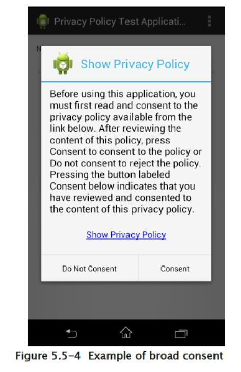

### 5.5.2 规则书

处理隐私策略时，遵循以下规则：

#### 5.5.2.1 将用户数据的传输限制为最低需求（必需）

将使用数据传输到外部服务器或其他目标时，将传输限制在提供服务的最低需求。 特别是，你应该设计为，应用只能访问这些用户数据，用户可以根据应用描述来想象它们的使用目的。 

例如，用户可以想象，它是个警报应用，但不能访问位置数据。另一方面，如果警报应用可以根据用户的位置发出警报，并将其功能写入应用的描述中，则应用可以访问位置数据。 

在只需要在应用中访问信息的情况下，避免将信息传输到外部，并采取其他措施来减少无意中泄漏用户数据的可能性。

#### 5.5.2.2 在首次加载（或应用更新）时，获得广泛同意来传输需要特别细致处理或用户可能难以更改的用户数据（必需）

如果应用向外部服务器，传输用户可能难以更改的任何用户数据，或需要特别细致处理的任何用户数据，则应用必须在用户开始使用之前，获得用户的预先同意（选择性加入） - 通知用户哪些类型的信息将被发送到服务器，以及是否会涉及任何第三方厂商。 更具体地说，首次启动时，应用应显示其应用隐私政策并确认该用户已阅读并同意。 此外，无论何时应用更新，通过将新类型的用户数据传输到外部服务器，它都必须再次确认用户已经阅读并同意这些更改。 如果用户不同意，应用应该终止或以其他方式采取措施，来确保所有需要传输数据的功能都被禁用。

这些步骤可以确保，用户了解他们在使用应用时如何处理数据，为用户提供安全感并增强他们对应用的信任。

MainActivity.java

```java
protected void onStart() {
    super.onStart();
    
    // (some portions omitted)
    
    if (privacyPolicyAgreed <= VERSION_TO_SHOW_COMPREHENSIVE_AGREEMENT_ANEW) {
        // *** POINT *** On first launch (or application update), obtain broad consent to transmit user data that will be handled by the application.
        // When the application is updated, it is only necessary to renew the user’s grant of broad consent if the updated application will handle new types of user data.
        ConfirmFragment dialog = ConfirmFragment.newInstance(
            R.string.privacyPolicy, R.string.agreePrivacyPolicy,
            DIALOG_TYPE_COMPREHENSIVE_AGREEMENT);
        dialog.setDialogListener(this);
        FragmentManager fragmentManager = getSupportFragmentManager();
        dialog.show(fragmentManager, "dialog");
    }
```


