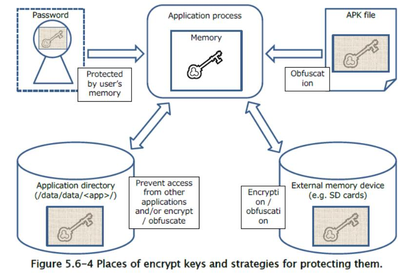

### 5.6.3 高级话题

#### 5.6.3.1 选择加密方法

在上面的示例代码中，我们展示了三种加密方法的实现示例，每种加密方法用于加密解密以及数据伪造的检测。 你可以使用“图 5.6-1”，“图 5.6-2”，根据你的应用粗略选择使用哪种加密方法。 另一方面，加密方法的更加精细的选择，需要更详细地比较各种方法的特征。 在下面我们考虑一些这样的比较。

用于加密和解密的密码学方法的比较

公钥密码术具有很高的处理成本，因此不适合大规模数据处理。但是，因为用于加密和解密的密钥不同，所以仅仅在应用侧处理公钥（即，只执行加密），并且在不同（安全）位置执行解密的情况下，管理密钥相对容易。共享密钥加密是一种通用的加密方案，但限制很少，但在这种情况下，相同的密钥用于加密和解密，因此有必要将密钥安全地存储在应用中，从而使密钥管理变得困难。基于密码的密钥系统（基于密码的共享密钥系统）通过用户指定的密码生成密钥，避免了在设备中存储密钥相关的密码的需求。此方法用于仅仅保护用户资产，但不保护应用资产的应用。由于加密强度取决于密码强度，因此有必要选择密码，其复杂度与要保护的资产价值成比例增长。请参阅“5.6.2.6 采取措施来增加密码强度（推荐）”。

表 5.6-4 用于加密和解密的密码学方法的比较

| 条目/加密方法 | 公钥 | 共享密钥 | 基于密码 |
| --- | --- | --- | --- |
| 处理大规模数据 | 否（开销太大） | OK | OK |
| 保护应用（或服务）资产 | OK | OK | 否（允许用户窃取） |
| 保护用户资产 | OK | OK | OK |
| 加密强度 | 取决于密钥长度 |  取决于密钥长度 | 取决于密码强度，盐和哈希重复次数 |
| 密钥存储 | 简单（仅公钥） | 困难 | 简单 |
| 由应用执行的过程 | 加密（解密在服务器或其它地方完成） | 加密和解密 | 加密和解密 |

用于检测数据伪造的密码学方法的比较

这里的比较与上面讨论的加密和解密类似，除了与数据大小对应的条目不再相关。

表 5.6-5 用于检测数据伪造的密码学方法的比较

| 条目/加密方法 | 公钥 | 共享密钥 | 基于密码 |
| --- | --- | --- | --- |
| 保护应用（或服务）资产 | OK | OK | 否（允许用户伪造） |
| 保护用户资产 | OK | OK | OK |
| 加密强度 | 取决于密钥长度 |  取决于密钥长度 | 取决于密码强度，盐和哈希重复次数 |
| 密钥存储 | 简单（仅公钥） | 困难，请参考“5.6.3.4 保护密钥” | 简单 |
| 由应用执行的过程 | 签名验证（签名在服务器或其它地方完成） | MAC 计算和验证 | MAC 计算和验证 |

MAC：消息认证代码


请注意，这些准则主要关注被视为低级或中级资产的资产保护，根据“3.1.3 资产分类和保护对策”一节中讨论的分类。 由于使用加密涉及的问题，比其他预防性措施（如访问控制）更多，如密钥存储问题，因此只有资产不能在 Android 操作系统安全模式下有效保护时，才应该考虑加密。

#### 5.6.3.2 随机数的生成

使用加密技术时，选择强加密算法和加密模式，以及足够长的密钥，来确保应用和服务处理的数据的安全性，这非常重要。 然而，即使所有这些选择都做得适当，当形成安全协议关键的密钥被泄漏或猜测时，所使用的算法所保证的安全强度立即下降为零。

即使对于在AES和类似协议下，用于共享密钥加密的初始向量（IV），或者用于基于密码的加密的盐，较大偏差也可以使第三方轻松发起攻击，从而增加数据泄漏或污染的风险 。 为了防止这种情况，有必要以第三方难以猜测它们的值的方式，产生密钥和 IV，而随机数在确保这一必要实现的方面，起着非常重要的作用。 产生随机数的设备称为随机数生成器。 尽管硬件随机数生成器（RNG）可能使用传感器或其他设备，通过测量无法预测或再现的自然现象来产生随机数，但更常见的是用软件实现的随机数生成器，称为伪随机数生成器（PRNG）。

在Android应用中，可以通过`SecureRandom`类生成用于加密的足够安全的随机数。 `SecureRandom`类的功能由一个称为`Provider`的实现提供。 多个供应器（实现）可以在内部存在，并且如果没有明确指定供应器，则会选择默认供应器。 出于这个原因，也可以在不知道供应器存在的情况下，使用`SecureRandom`来实现。 在下面,我们提供的例子演示了如何使用`SecureRandom`。 

请注意，根据 Android 版本的不同，`SecureRandom`可能存在一些缺陷，需要在实施中采取预防措施。 请参阅“5.6.3.3 防止随机数生成器中的漏洞的措施”。

使用`SecureRandom`（默认实现）

```java
import java.security.SecureRandom;

[...]

SecureRandom random = new SecureRandom();
byte[] randomBuf = new byte [128];
random.nextBytes(randomBuf);

[...]
```

使用`SecureRandom`（明确的特定算法）

```java
import java.security.SecureRandom;

[...]

SecureRandom random = SecureRandom.getInstance("SHA1PRNG");
byte[] randomBuf = new byte [128];
random.nextBytes(randomBuf);

[...]
```

使用`SecureRandom`（明确的特定实现（供应器））

```java
import java.security.SecureRandom;

[...]

SecureRandom random = SecureRandom.getInstance("SHA1PRNG", “Crypto”);
byte[] randomBuf = new byte [128];
random.nextBytes(randomBuf);

[...]
```

程序中发现的伪随机数发生器，例如`SecureRandom`，通常基于一些基本过程来操作，如“图 5.6-3 伪随机数发生器的内部过程”中所述。 输入一个随机数种子来初始化内部状态；此后，每次生成随机数时更新内部状态，从而允许生成随机数序列。

随机数种子

种子在伪随机数发生器（PRNG）中起着非常重要的作用。 如上所述，PRNG 必须通过指定种子来初始化。 此后，用于生成随机数的过程是确定性算法，因此如果指定相同的种子，则会得到相同的随机数序列。 这意味着如果第三方获得（即窃听）或猜测 PRNG 的种子，他可以产生相同的随机数序列，从而破坏随机数提供的机密性和完整性属性。

出于这个原因，随机数生成器的种子本身就是一个高度机密的信息 - 而且必须以无法预测或猜测的方式来选择。 例如，不应使用时间信息或设备特定数据（例如 MAC 地址，IMEI 或 Android ID）来构建 RNG 种子。 在许多 Android 设备上，`/dev/urandom`或`/dev/random`可用，Android 提供的`SecureRandom`默认实现使用这些设备文件，来确定随机数生成器的种子。 就机密性而言，只要 RNG 种子仅存在于内存中，除获得 root 权限的恶意软件工具外，几乎没有由第三方发现的风险。 如果你需要实现，即使在已 root 的设备上仍然有效的安全措施，请咨询安全设计和实现方面的专家。

伪随机数生成器的内部状态

伪随机数发生器的内部状态由种子初始化，然后在每次生成随机数时更新。 就像由相同种子初始化的 PRNG 一样，具有相同内部状态的两个 PRNG 随后将产生完全相同的随机数序列。 因此，保护内部状态免受第三方窃听也很重要。 但是，由于内部状态存在于内存中，除了拥有 root 访问权的恶意软件工具外，几乎没有发现任何第三方的风险。 如果你需要实现，即使在已 root 的设备上仍然有效的安全措施，请咨询安全设计和实现方面的专家。

#### 5.6.3.3 防范随机数生成器中的漏洞的措施


在 Android 4.3.x 及更早版本中发现，`SecureRandom`的`Crypto`供应器实现拥有内部状态熵（随机性）不足的缺陷。 特别是在 Android 4.1.x 及更早版本中，`Crypto`供应器是`SecureRandom`的唯一可用实现，因此大多数直接或间接使用`SecureRandom`的应用都受此漏洞影响。 同样，Android 4.2 和更高版本中，作为`SecureRandom`的默认实现而提供的`AndroidOpenSSL`供应器拥有这个缺陷，由`OpenSSL`使用的作为随机数种子的大部分数据在应用之间共享（Android 4.2.x-4.3 .x），产生了一个漏洞，任何应用都可以轻松预测其他应用生成的随机数。 下表详细说明了各种 Android OS 版本中存在的漏洞的影响。

表 5.6-6 Android操作系统版本和受到每个漏洞的影响的功能

| Android OS/漏洞 | `SecureRandom`的`Crypto`供应器实现的内部状态熵不足 | 可以猜测其他程序中`OpenSSL`所使用的随机数 |
| --- | --- | --- |
|  4.1.x 及之前 | `SecureRandom`的默认实现，`Crypto`供应器的显式使用，由`Cipher`类提供的加密功能，HTTPS 通信功能等 | 无影响 |
| 4.2 - 4.3.x | 使用明确标识的`Crypto`供应器 | `SecureRandom`的默认实现，Android OpenSSL 供应器的显式使用，`OpenSSL`提供的随机数生成功能的直接使用，由`Cipher`类提供的加密功能，HTTPS 通信功能等 |
| 4.4 及之后 | 无影响 | 无影响 |

自 2013 年 8 月以来，Google 已经向其合作伙伴（设备制造商等），分发了用于消除这些 Android 操作系统漏洞的补丁。但是，与`SecureRandom`相关的这些漏洞影响了广泛的应用，包括加密功能和 HTTPS 通信功能，并且据推测许多设备仍未修补。 因此，在设计针对 Android 4.3.x 和更早版本的应用时，我们建议你采纳以下站点中讨论的对策（实现）。

<http://android-developers.blogspot.jp/2013/08/some-securerandom-thoughts.html>

#### 5.6.3.4 密钥保护

使用加密技术来确保敏感数据的安全性（机密性和完整性）时，只要密钥本身的数据内容是可用的，即使最健壮的加密算法和密钥长度，也不能保护数据免受第三方攻击。 出于这个原因，正确处理密钥是使用加密时需要考虑的最重要的项目之一。 当然，根据你尝试保护的资产的级别，正确处理密钥可能需要非常复杂的设计和实现技术，这些技术超出了本指南的范围。 在这里，我们只能提供一些基本想法，有关安全处理各种应用和密钥的存储位置; 我们的讨论没有扩展到特定的实现方法，并且必要时我们建议你咨询安全设计和实现方面的专家。

首先，“图 5.6-4 加密密钥的位置和保护它们的策略”，说明了 Android 智能手机和平板电脑中，用于储存密钥和相关用途的各种位置，并概述了保护它们的策略。



下表总结了受密钥保护的资产的资产类别，以及适用于各种资产所有者的保护策略。 资产类别的更多信息，请参阅“3.1.3 资产分类和保护对策”。

表 5.6-7 资产分类和保护对策

| 资产所有者 | 设备用户 | | 应用/服务供应者 | |
| --- | --- | --- | --- | --- |
| 资产级别 | 高 | 中低 | 高 | 中低 |
| 密钥储存位置 | | 保护策略 | | |
| 用户内存 | 提高密码强度 | | 不允许使用用户密码 | |
| 应用目录（非公共存储） | 密钥加密或混淆 | 禁止来自应用外部的读写操作 | 密钥加密或混淆 | 禁止来自应用外部的读写操作 | 
| APK 文件 | | 混淆密钥数据。注：要注意大多数 Java 混淆工具，例如 Proguard，不会混淆数据字符串。 | | |
| SD 卡或者其它（公共存储） |  | 加密或混淆密钥数据 | | |

在下文中，我们讨论适用于存储密钥的各个地方的保护措施。

储存在用户内存中的密钥

这里我们考虑基于密码的加密。 从密码生成密钥时，密钥存储位置是用户内存，因此不存在由于恶意软件而造成泄漏的危险。 但是，根据密码的强度，可能很容易重现密钥。 出于这个原因，有必要采取步骤来确保密码的强度， 类似于让用户指定服务登录密码时采取的步骤；例如，密码可能受到 UI 的限制，或者可能会使用警告消息。 请参阅“5.6.2.6 采取措施增加密码的强度（推荐）”。 当然，当密码存储在用户用户中时，必须记住密码将被遗忘的可能性。 为确保在忘记密码的情况下可以恢复数据，必须将备份数据存储在设备以外的安全位置（例如服务器上）。

储存在应用目录中的密钥

当密钥以私有模式，存储在应用目录中时，密钥数据不能被其他应用读取。 另外，如果应用禁用备份功能，用户也将无法访问数据。 因此，当存储用于保护应用资产的密钥时，应该禁用备份。 

但是，如果你还需要针对使用 root 权限的应用或用户保护密钥，则必须对密钥进行加密或混淆。 对于用于保护用户资产的密钥，你可以使用基于密码的加密。 对于用于加密应用资产的密钥，你希望这些资产对于用户是不可见的，你必须将用于资产加密的密钥存储在 APK 文件中，并且必须对密钥数据进行混淆处理。

储存在 APK 文件中的密钥

由于可以访问APK文件中的数据，因此通常这不适合存储机密数据（如密钥）。 在 APK 文件中存储密钥时，你必须对密钥数据进行混淆处理，并采取措施确保数据无法轻易从 APK 文件中读取。

储存在公共存储位置（例如 SD 卡）的密钥

由于公共存储可以被所有应用访问，因此通常它不适合存储机密数据（如密码）。 将密钥存储在公共位置时，需要对密钥数据进行加密或混淆处理，来确保无法轻易访问数据。 另请参阅上面的“存储在应用目录中的密钥”中提出的保护措施，来了解还必须针对具有 root 权限的应用或用户来保护密钥。

在进程内存中处理密钥

使用 Android 中可用的加密技术时，必须在加密过程之前，在上图中所示的应用进程以外的地方，对加密或混淆的密钥数据进行解密（或者，对于基于密码的密钥，则需要生成密钥）。在这种情况下，密钥数据将以未加密的形式驻留在进程内存中。另一方面，应用的内存通常不会被其他应用读取，因此如果资产类别位于这些准则涵盖的范围内，则没有采取特定步骤来确保安全性的特别需求。在密钥数据以未加密的形式出现（即使它们以这种方式存在于进程内存中）是不可接受的的情况下，由于特定目标或由应用处理的资产级别，可能有必要对密钥数据和加密逻辑，采取混淆处理或其他技术。但是，这些方法在 Java 层面上难以实现；相反，你将在 JNI 层面上使用混淆工具。这些措施不在本准则的范围之内；咨询安全设计和实现方面的专家。

