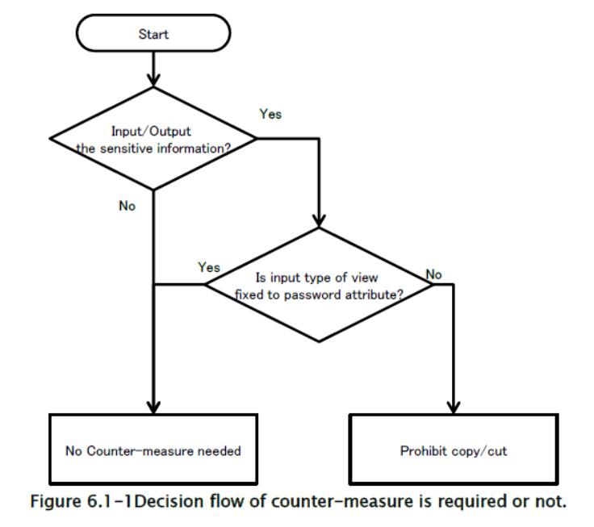

# 六、困难问题

在 Android 中，由于 Android 操作系统规范或 Android 操作系统提供的功能，难以确保应用程序实现的安全性。 这些功能被恶意第三方滥用或用户不小心使用，始终存在可能导致信息泄露等安全问题的风险。 本章通过指出开发人员可以针对这些功能采取的风险缓解计划，将一些需要引起注意的主题挑选为文章。

## 6.1 来自剪贴板的信息泄露风险

复制和粘贴是用户经常以不经意的方式使用的功能。 例如，不少用户使用这些功能来存储好奇或重要的信息，将邮件或网页中的东西记到记事本中，或者从存储密码的记事本复制并粘贴密码，以便不会提前忘记。 这些明显非常随意的行为，但实际上存在用户处理的信息可能被盗的隐藏风险。

这个风险与 Android 系统中的复制粘贴机制有关。 用户或应用程序复制的信息，曾经存储在称为剪贴板的缓冲区中。 存储在剪贴板中的信息，在被用户或应用程序粘贴时，分发给其他应用程序。 所以这个剪贴板功能中存在导致信息泄漏的风险。 这是因为剪贴板的实体在系统中是唯一的，并且任何应用程序都可以使用`ClipboardManager`，随时获取存储在剪贴板中的信息。 这意味着用户复制/剪切的所有信息都会泄露给恶意应用程序。

因此，考虑到 Android 操作系统的规范，应用程序开发人员需要采取措施，尽量减少信息泄露的可能性。

### 6.1.1 示例代码

粗略地说，有两种对策用于减轻来自剪贴板的信息泄露风险

1.  从其他应用程序复制到你的应用程序时采取对策。
2.  从你的应用程序复制到其他应用程序时采取对策。

首先，让我们讨论上面的对策（1）。 假设用户从其他应用程序（如记事本，Web 浏览器或邮件应用程序）复制字符串，然后将其粘贴到你的应用程序的`EditText`中。 事实证明，在这种情况下，基本没有对策，来防止由于复制和粘贴而导致的敏感信息泄漏。 由于 Android 中没有功能来控制第三方应用程序的复制操作。 因此，就对策（1）而言，除了向用户解释复制和粘贴敏感信息的风险外，没有任何方法，只能继续让用户自行减少操作。

接下来的讨论是上面的对策（2），假设用户复制应用程序中显示的敏感信息。 在这种情况下，防止泄漏的有效对策是，禁止来自视图（`TextView`，`EditText`等）的复制/剪切操作。 如果输入/输出敏感信息（如个人信息）的视图中，没有复制/剪切功能，信息泄漏永远不会通过剪贴板在您的应用程序发生。

有几种禁止复制/剪切的方法。 本节介绍简单有效的方法：一种方法是禁用视图的长按，另一种方法是在选择字符串时从菜单中删除复制/剪切条目。 

对策的必要性可以根据图 6.1-1 的流程确定。 在图 6.1-1 中，“输入类型固定为密码属性”表示，输入类型在应用程序运行时必须是以下三种之一。 在这种情况下，由于默认禁止复制/剪切，因此不需要采取对策。

+   `InputType.TYPE_CLASS_TEXT | InputType.TYPE_TEXT_VARIATION_PASSWORD`
+   `InputType.TYPE_CLASS_TEXT | InputType.TYPE_TEXT_VARIATION_WEB_PASSWORD`
+   `InputType.TYPE_CLASS_NUMBER | InputType.TYPE_NUMBER_VARIATION_PASSWORD`



以下小节使用每个示例代码详细介绍了对策。

#### 6.1.1.1 选择字符串时，从菜单中删除复制/剪切条目

在 Android 3.0（API Level 11）之前不能使用`TextView.setCustomSelectionActionMODECallback()`方法。 在这种情况下，禁止复制/剪切的最简单方法是禁用视图的长按。 禁用视图的长按可以在`layout.xml`文件中规定。 

下面展示了示例代码，用于从`EditText`中的字符串选择菜单中删除复制/剪切条目。

要点：

1.  从字符串选择菜单中删除`android.R.id.copy`。
2.  从字符串选择菜单中删除`android.R.id.cut`。

UncopyableActivity.java

```java
package org.jssec.android.clipboard.leakage;

import android.app.Activity;
import android.os.Bundle;
import android.support.v4.app.NavUtils;
import android.view.ActionMode;
import android.view.Menu;
import android.view.MenuItem;
import android.widget.EditText;

public class UncopyableActivity extends Activity {

    private EditText copyableEdit;
    private EditText uncopyableEdit;
    
    @Override
    public void onCreate(Bundle savedInstanceState) {
        super.onCreate(savedInstanceState);
        setContentView(R.layout.uncopyable);
        copyableEdit = (EditText) findViewById(R.id.copyable_edit);
        uncopyableEdit = (EditText) findViewById(R.id.uncopyable_edit);
        // By setCustomSelectionActionMODECallback method,
        // Possible to customize menu of character string selection.
        uncopyableEdit.setCustomSelectionActionModeCallback(actionModeCallback);
    }
    
    private ActionMode.Callback actionModeCallback = new ActionMode.Callback() {
    
        public boolean onPrepareActionMode(ActionMode mode, Menu menu) {
            return false;
        }
        
        public void onDestroyActionMode(ActionMode mode) {
        }
        
        public boolean onCreateActionMode(ActionMode mode, Menu menu) {
            // *** POINT 1 *** Delete android.R.id.copy from the menu of character string selection.
            MenuItem itemCopy = menu.findItem(android.R.id.copy);
            if (itemCopy != null) {
                menu.removeItem(android.R.id.copy);
            }
            // *** POINT 2 *** Delete android.R.id.cut from the menu of character string selection.
            MenuItem itemCut = menu.findItem(android.R.id.cut);
            if (itemCut != null) {
                menu.removeItem(android.R.id.cut);
            }
            return true;
        }
        
        public boolean onActionItemClicked(ActionMode mode, MenuItem item) {
            return false;
        }
    };
    
    @Override
    public boolean onCreateOptionsMenu(Menu menu) {
        getMenuInflater().inflate(R.menu.uncopyable, menu);
        return true;
    }
    
    @Override
    public boolean onOptionsItemSelected(MenuItem item) {
        switch (item.getItemId()) {
            case android.R.id.home:
                NavUtils.navigateUpFromSameTask(this);
                return true;
        }
        return super.onOptionsItemSelected(item);
    }
}
```

#### 6.1.1.2 禁用视图的长按

禁止复制/剪切也可以通过禁用视图的长按来实现。 禁用视图的长按可以在`layout.xml`文件中规定。

要点：

1.  在视图中将`android:longClickable`设置为`false`，来禁止复制/剪切。

unlongclickable.xml

```xml
<LinearLayout xmlns:android="http://schemas.android.com/apk/res/android"
    xmlns:tools="http://schemas.android.com/tools"
    android:layout_width="match_parent"
    android:layout_height="match_parent"
    android:orientation="vertical">
    <TextView
    android:layout_width="match_parent"
    android:layout_height="wrap_content"
    android:text="@string/unlongclickable_description" />
    <!-- EditText to prohibit copy/cut EditText -->
    <!-- *** POINT 1 *** Set false to android:longClickable in View to prohibit copy/cut. -->
    <EditText
    android:layout_width="match_parent"
    android:layout_height="wrap_content"
    android:longClickable="false"
    android:hint="@string/unlongclickable_hint" />
</LinearLayout>
```

### 6.1.2 规则书

将敏感信息从你的应用程序复制到其他应用程序时，请遵循以下规则：

#### 6.1.2.1 禁用视图中显示的复制/剪切字符串（必需）

如果应用程序中存在显示敏感信息的视图，并且允许在视图中像`EditText`一样复制/剪切信息，信息可能会通过剪贴板泄漏。 因此，必须在显示敏感信息的视图中禁用复制/剪切。 有两种方法禁用复制/剪切。 一种方法是从字符串选择菜单中删除复制/剪切条目，另一种方法是禁用视图的长按。 请参阅“6.1.3.1 应用规则时的注意事项”。

